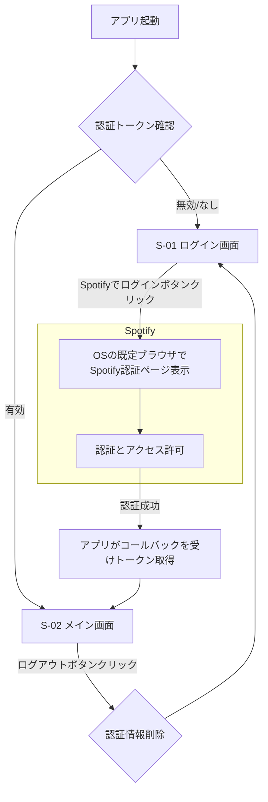

## Spotifyプレイリスト管理アプリケーション 外部設計書【WPF-dll実装版】

**文書バージョン:** 2.0
**作成日:** 2025/06/13
**対象読者:** 開発チーム（プロダクトオーナー、スクラムマスター、開発者）

### 1. はじめに

#### 1.1. 本書の目的
本書は、「Spotifyプレイリスト管理アプリケーション 要件定義書【WPF版 v1.1】」に基づき、**MVP（Minimum Viable Product）として初期リリースを目指す機能群の外部設計**を詳細に定義することを目的とします。特に、本設計書は**各機能を独立したDLL（ダイナミックリンクライブラリ）に分割するモジュール化アーキテクチャ**を前提としています。開発チームは本書を初期スプリント計画のインプットとして利用してください。

#### 1.2. スクラム開発における本書の位置づけ
本プロジェクトはスクラム手法を用いて開発を進めます。本書は、プロダクトの初期構想を具体化したものであり、ここに記載された仕様は**プロダクトバックログの出発点**となります。各機能はプロダクトバックログアイテム（PBI）として管理され、その詳細や実装順序はスプリント計画ミーティングを通じて決定・調整されます。本書は、開発の進行に合わせて継続的に更新される可能性があります。

### 2. システム仕様

#### 2.1. システム構成
- **種別:** Windowsデスクトップアプリケーション
- **フレームワーク:** WPF (.NET)
- **開発言語:** C#, XAML
- **アーキテクチャ:**
    - **MVVM (Model-View-ViewModel) パターン**
    - **DI (Dependency Injection) コンテナ** を用いた疎結合な設計
    - **モジュール化アーキテクチャ (DLL分割)**
- **認証方式:** Authorization Code Flow with PKCE (Proof Key for Code Exchange)

#### 2.2. モジュール構成 (DLL分割)
本アプリケーションは、以下の独立したライブラリ（DLL）と、それらを統合する実行ファイル（EXE）で構成されます。

| プロジェクト名 | 役割 |
| :--- | :--- |
| **`SpotifyManager.Core.dll`** | **共通基盤ライブラリ:** アプリケーション全体で共有されるインターフェース、データモデル、基本クラスを定義する。 |
| **`SpotifyManager.Auth.dll`** | **認証機能モジュール:** Spotify認証、トークン管理、資格情報マネージャーへのアクセスなど、認証に関するすべてのロジックを実装する。 |
| **`SpotifyManager.Playlist.dll`** | **プレイリスト機能モジュール:** プレイリストおよび楽曲の取得、表示、削除に関するロジックとViewModelを実装する。 |
| **`SpotifyManager.Theme.dll`** | **テーマ機能モジュール:** ライト/ダークテーマの切り替え、設定の永続化、関連リソースを管理する。 |
| **`SpotifyManager.Wpf.exe`** | **メインアプリケーション:** UI(View)の定義と、上記すべてのDLLモジュールをDIコンテナを用いて統合する役割を担う。 |

```mermaid
graph TD
    subgraph SpotifyManager.Wpf.exe
        A[Views (XAML)]
        B[App.xaml.cs (DIコンテナ設定)]
    end

    subgraph SpotifyManager.Auth.dll
        C[AuthService]
        D[LoginViewModel]
    end

    subgraph SpotifyManager.Playlist.dll
        E[PlaylistService]
        F[MainViewModel]
        G[Playlist/Track ViewModel]
    end

    subgraph SpotifyManager.Theme.dll
        H[ThemeService]
        I[Theme Resources]
    end

    subgraph SpotifyManager.Core.dll
        J[Interfaces (IAuthService, etc.)]
        K[Models (Playlist, Track)]
    end

    B --> A
    B --> C
    B --> E
    B --> H

    C --> J
    D --> J
    E --> J
    F --> J
    H --> J

    C --> K
    E --> K
    G --> K
```

#### 2.3. 動作環境
- **対応OS:** Windows 10 (64bit), Windows 11 (64bit)
- **必須ランタイム:** .NET Runtime (アプリケーションに同梱または別途インストール)

### 3. MVPの画面仕様

MVPでは、以下の2画面を実装対象とします。これらのViewは **`SpotifyManager.Wpf.exe`** に配置されます。

#### 3.1. 画面一覧
| 画面ID | 画面名 (View) | 概要 |
| :--- | :--- | :--- |
| S-01 | ログイン画面 (`LoginView.xaml`) | アプリケーション起動時に認証情報がない場合に表示される。 |
| S-02 | メイン画面 (`MainView.xaml`) | ログイン後に表示されるメイン画面。プレイリストと楽曲の管理を行う。 |

#### 3.2. 画面遷移図



#### 3.3. 画面詳細

##### 3.3.1. S-01: ログイン画面
- **概要:** アプリケーションの初期画面。ウィンドウ中央に表示される。
- **表示項目とコンポーネント:**
    1.  **アプリケーションロゴ/タイトル:** 画面上部にアプリケーションの名称やロゴを表示する。
    2.  **ログインボタン:** 画面中央に「Spotifyでログイン」と表示されたボタンを配置する。
- **振る舞い:**
    1. アプリケーションは起動時、ローカル（Windows Credential Manager）に保存された有効なリフレッシュトークンの有無を確認する。
    2. トークンが存在しない、または無効な場合、この画面を表示する。
    3. ユーザーが「Spotifyでログイン」ボタンをクリックすると、PBI-01の認証フローが開始される。

##### 3.3.2. S-02: メイン画面
- **画面レイアウト:**
    - **ヘッダー:** ウィンドウ上部にタイトルバーと一体化した領域を設け、アプリケーションタイトル、テーマ切替ボタン、ログアウトボタンを配置する。
    - **メインコンテンツ:** プレイリスト一覧を表示するエリア。このエリアはスクロール可能とする。
    - **フッター:** ウィンドウ下部に「Delete」ボタンを配置するエリア。このエリアはウィンドウ下部に固定表示する。
- **表示項目とコンポーネント:**
    - **テーマ切替ボタン:** 現在のテーマ（ライト/ダーク）に応じてアイコンが切り替わるボタン。
    - **ログアウトボタン:** ログアウト処理を開始するボタン。
    - **プレイリスト一覧 (`TreeView` or `ItemsControl` with `Expander`):** ユーザーの全プレイリストを階層表示する。
        - **親項目 (プレイリスト):** チェックボックス、60x60pxのカバー画像、タイトルを表示。
        - **子項目 (楽曲):** チェックボックス、40x40pxのアルバムカバー画像、「曲タイトル - アーティスト名」形式のテキストを表示。
    - **削除ボタン (`DeleteButton`):** 画面下部に配置された、選択アイテムを削除するためのボタン。

### 4. MVPの機能仕様と受け入れ基準

MVPでは、要件定義書のPBI-01からPBI-06までを実装対象とします。各機能は独立したPBIとしてスプリントで実装され、それぞれが対応するDLLで主に開発されます。

#### 4.1. PBI-01: Spotify認証機能
- **担当モジュール:** **`SpotifyManager.Auth.dll`**
- **仕様:** `Client Secret` を使用しない「Authorization Code Flow with PKCE」方式でSpotify認証を実装する。認証後、リフレッシュトークンをWindows Credential Managerに保存し、次回以降の自動ログインを実現する。ログアウト時には保存したトークンを削除する。本機能は `IAuthService` インターフェースを通じて他のモジュールに提供される。
- **受け入れ基準:**
    - GIVEN: ユーザーが未認証の状態でアプリを起動したとき
    - WHEN: ログイン画面が表示され、「Spotifyでログイン」ボタンをクリックすると
    - THEN: OSの既定ブラウザでSpotifyの認証ページが開くこと。
    - GIVEN: ユーザーがSpotifyで認証を許可したとき
    - WHEN: アプリがコールバックを受け取ると
    - THEN: メイン画面が表示され、ユーザーのプレイリスト取得が開始されること。
    - GIVEN: ユーザーが認証済みの状態でアプリを再起動したとき
    - THEN: ログイン画面を経由せず、直接メイン画面が表示されること。
    - GIVEN: ユーザーがメイン画面で「ログアウト」ボタンをクリックし、確認ダイアログで「はい」を選択したとき
    - THEN: 認証情報が削除され、ログイン画面に戻ること。

#### 4.2. PBI-02 & PBI-03: プレイリスト・楽曲表示機能
- **担当モジュール:** **`SpotifyManager.Playlist.dll`**
- **仕様:** ログイン後、ユーザーが所有・フォローする全プレイリストを非同期で取得し、一覧表示する。各プレイリストは展開可能とし、展開時にそのプレイリストに含まれる全楽曲を非同期で取得・表示する。本機能は `IPlaylistService` 等のインターフェースを通じてデータ取得が行われる。
- **受け入れ基準:**
    - GIVEN: ユーザーがメイン画面に遷移したとき
    - WHEN: プレイリストのロードが完了すると
    - THEN: ユーザーの全プレイリストが「カバー画像 - タイトル」形式で一覧表示されること。
    - GIVEN: ユーザーが特定のプレイリスト項目をクリックして展開したとき
    - WHEN: 楽曲のロードが完了すると
    - THEN: そのプレイリスト内の全楽曲が「アルバムカバー画像 - 曲タイトル - アーティスト名」形式で一覧表示されること。
    - GIVEN: ユーザーが編集権限のないプレイリストを展開したとき
    - THEN: 楽曲のチェックボックスが非表示または非活性であること。
    - GIVEN: API通信中であるとき
    - THEN: UI上にローディングインジケーターが表示されること。

#### 4.3. PBI-04: アイテム選択機能
- **担当モジュール:** **`SpotifyManager.Playlist.dll`** (ViewModel) / **`SpotifyManager.Wpf.exe`** (View)
- **仕様:** プレイリストおよび楽曲の各項目にチェックボックスを設け、ユーザーが削除対象を複数選択できるようにする。ViewModelのプロパティとViewのコントロールをデータバインディングで連携させる。
- **受け入れ基準:**
    - GIVEN: メイン画面にアイテムが表示されているとき
    - WHEN: ユーザーがプレイリストまたは楽曲のチェックボックスをクリックすると
    - THEN: そのチェックボックスのON/OFF状態が切り替わること。
    - GIVEN: 画面上にチェックされたアイテムが1つもないとき
    - THEN: 「Delete」ボタンが非活性であること。
    - GIVEN: 画面上にチェックされたアイテムが1つ以上あるとき
    - THEN: 「Delete」ボタンが活性化すること。

#### 4.4. PBI-05: アイテム削除機能
- **担当モジュール:** **`SpotifyManager.Playlist.dll`**
- **仕様:** 活性化された「Delete」ボタンがクリックされた際、確認ダイアログを表示後、選択された全アイテムをSpotifyアカウントから削除する。処理は非同期で行い、完了後にUIを更新する。
- **受け入れ基準:**
    - GIVEN: 1つ以上のアイテムが選択され、「Delete」ボタンがクリックされたとき
    - THEN: 「この操作は元に戻せません。よろしいですか？」といった内容の確認ダイアログが表示されること。
    - GIVEN: 確認ダイアログで「はい」が選択されたとき
    - WHEN: 削除処理が完了すると
    - THEN: プレイリスト一覧がリフレッシュされ、削除されたアイテムが表示から消えること。
    - GIVEN: 削除処理中であるとき
    - THEN: UI上に処理中であることを示すインジケーターが表示されること。

#### 4.5. PBI-06: テーマ切替機能
- **担当モジュール:** **`SpotifyManager.Theme.dll`**
- **仕様:** ライトテーマとダークテーマを切り替えるボタンを実装する。選択したテーマはアプリケーションを再起動しても維持される。本機能は `IThemeService` インターフェースを通じて制御される。
- **受け入れ基準:**
    - GIVEN: アプリケーションが起動しているとき
    - WHEN: テーマ切替ボタンをクリックすると
    - THEN: アプリケーション全体の配色がライト/ダークで即座に切り替わること。
    - GIVEN: ユーザーがテーマを切り替えた後、アプリを再起動したとき
    - THEN: 前回選択したテーマが適用された状態で起動すること。

### 5. 非機能仕様

#### 5.1. ユーザビリティ
- **レスポンシブUI:** ウィンドウサイズを変更しても、`Grid`や`StackPanel`などのレイアウトコントロールにより、表示が崩れず適切にリサイズされる。
- **フィードバック:** API通信中や削除処理実行時には、プログレスリングやオーバーレイを表示し、ユーザーに処理中であることを明示する。

#### 5.2. パフォーマンス
- **非同期処理:** 全てのネットワーク通信や時間のかかるI/O処理は`async/await`を用いて非同期で実行し、UIスレッドの応答性を確保する。
- **UI仮想化:** 大量のリスト項目を扱う`ItemsControl`では、UI仮想化を有効にし、スクロール時のパフォーマンスを維持する。

#### 5.3. セキュリティ
- **ClientIDの管理:**
    - Spotify APIの`Client ID`は、外部ファイルやレジストリには保存しません。
    - ソースコード内に直接平文で記述するのではなく、**難読化して埋め込みます。**
    - **実装方針:** ClientIDの文字列を複数に分割した配列や、Base64等でエンコードした文字列としてコード内に保持し、実行時に復元して使用します。これにより、アプリケーションバイナリを単純に文字列検索しても`Client ID`が直接発見されることを防ぎ、一定の秘匿性を確保します。
- **トークンの保管:**
    - ユーザーのリフレッシュトークンは、Windows Credential Managerに暗号化して保存します。アプリケーションコードやファイル内に平文で保持しません。

#### 5.4. 拡張性・保守性
- **モジュール化の徹底:** 本アーキテクチャは、機能を独立したDLLに分割することで、高い拡張性と保守性を実現します。各DLLは疎結合であり、個別の開発、テスト、デプロイが可能です。
- **MVVMの遵守:** View、ViewModel、Modelの責務を厳密に分離します。
- **DIの活用:** `App.xaml.cs`でDIコンテナを設定し、インターフェースと実装クラスを紐付けます。これにより、モジュール間の依存関係を柔軟に管理します。

### 6. 外部インターフェース仕様

#### 6.1. Spotify Web API
- **利用APIエンドポイント一覧 (MVP):**
    | HTTPメソッド | エンドポイント | 担当PBI |
    | :--- | :--- | :--- |
    | `GET` | `/v1/me/playlists` | PBI-02 |
    | `GET` | `/v1/playlists/{playlist_id}/tracks` | PBI-03 |
    | `DELETE` | `/v1/playlists/{playlist_id}/followers` | PBI-05 |
    | `DELETE` | `/v1/playlists/{playlist_id}/tracks` | PBI-05 |
- **レートリミット対応:** APIから`429 Too Many Requests`が返された場合は、処理を中断し、ユーザーに「時間をおいて再度お試しください」というエラーメッセージを表示します。

### 7. 将来のプロダクトバックログアイテム

以下の機能はMVPの範囲外とし、将来のリリース候補としてプロダクトバックログで管理します。これらの機能は、それぞれ新しい機能モジュール（DLL）として実装されることが想定されます。

| PBI ID | 機能名 (ユーザーストーリー) | 想定される担当モジュール |
| :--- | :--- | :--- |
| PBI-07 | **検索:** 特定の曲を探すため、全プレイリストを横断して楽曲を検索したい | `SpotifyManager.Search.dll` |
| PBI-08 | **重複検出:** ライブラリを整理するため、プレイリスト内の重複曲を検出・削除したい | `SpotifyManager.DuplicateFinder.dll` |
| PBI-09 | **設定:** アプリの動作をカスタマイズするため、設定画面が欲しい | `SpotifyManager.Settings.dll` |